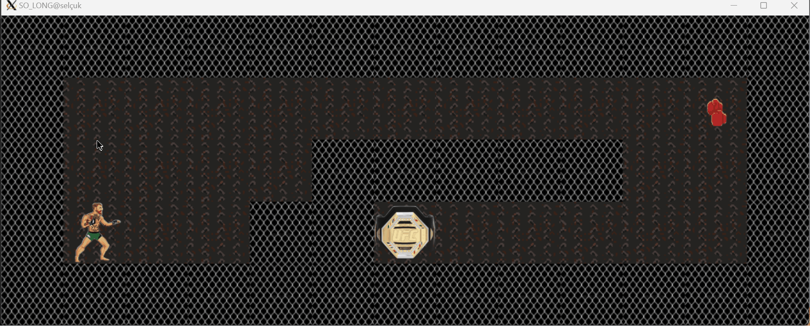

# so_long

so_long is a simple 2D game developed using the MLX42 library. The objective of the game is to navigate through a maze, collect items, and reach the exit.

## Features

- 2D graphics using MLX42
- Simple and intuitive controls
- Collect items to progress
- Navigate through a maze to reach the exit

## Installation

1. Clone the repository:
    ```sh
    git clone https://github.com/selcyilm/so_long.git
    ```

2. Navigate to the project directory:
    ```sh
    cd so_long
    ```

3. Build the project:
    ```sh
    make
    ```

## Demo



## Controls

- **W**: Move up
- **A**: Move left
- **S**: Move down
- **D**: Move right
